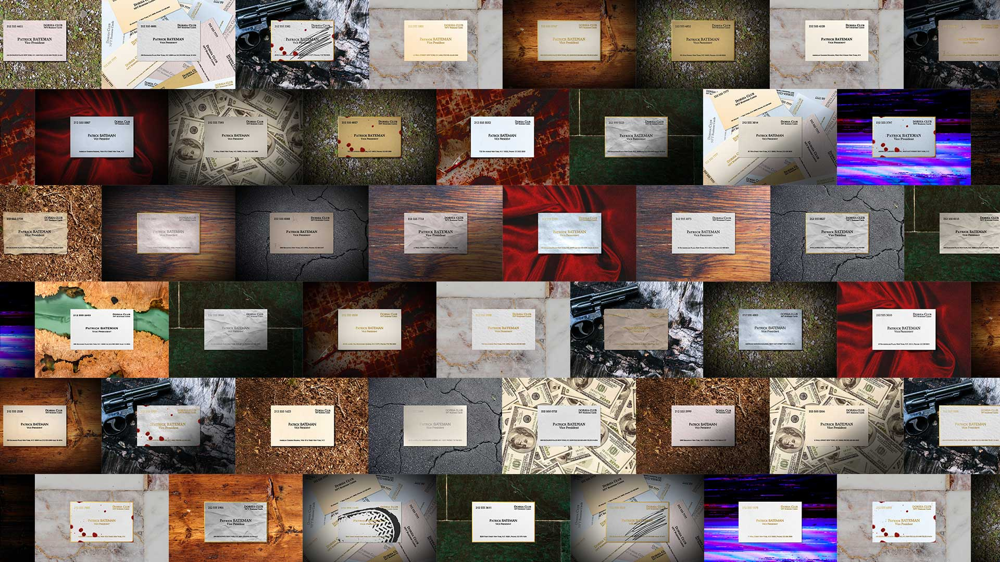

# Dorsia Club - Customizable NFT Business Cards

The original idea behind this project was to create an NFT that users could customize, so that they could truly own their token: a dynamic NFT.

The end result is an NFT Business Card whose assets get randomly generated at the time of minting, but which has name and positions that get defined by the user.

## The Business Card

The NFT is powered by the Business Card [smart contract](./src/contracts/BusinessCard/contracts/BusinessCard.sol), which is an extension of the ERC-721 token standard. What these changes do, in short, is:
- Store the name, position, and genes (used to generate the asset) of each Business Card on-chain
- [Validate](./src/contracts/BusinessCard/contracts/BusinessCardUtils.sol) the name and position directly on-chain, to ensure that the oracle is able to generate the asset
- Allow a whitelisted oracle to update the token metadata once it has constructed the corresponding Business Card
- Allows an end user to mint a new Card, change the name and/or position of a Card they own, or swap the name and position between two Cards they own
- Emits a new event every time a Business Card gets updated so that it can be picked up by the oracle
- Automatically funds the oracle so that it can perform its callback and update Business Cards as required

## The Oracle

The [oracle](./src/oracle/oracle.py) is continuously listening for new update events, that indicate it that it needs to generate a new Business Card image. The assets that define this image are given by the genes attribute from the smart contract. The oracle constructs this [Business Card](./src/oracle/card.py), and will then upload this image onto IPFS. The resulting token metadata IPFS hash is uploaded on-chain. This whole process can take as little as 30 seconds.

As I intend to launch this project comercially in the near future, the assets used for generating these Business Cards will not be made available in this repository.

If you wish to test the functioning of this oracle on a local blockchain, you can follow these [instructions](./src/oracle/README.md).

## The Website

Built on React.js and supporting Metamask, it allows end users to:
- Mint new Business Cards
- Change the name and/or position of a Card they own
- Swap the name and position between two Cards they own
- Create and cancel market listings
- Buy market listings
- Check the gallery to see all existing Cards, or the ones they own, or the marketplace listed items
- (Soon) Send copies of their Business Cards as Soulbound Cards, or burn sent Soulbound Cards
- (Soon) Check or burn the Soulbound Cards they have received

## Possible improvements

Business Card attributes are generated using the _keccak256_ hashing function as a source of randomness, and using as one of the inputs the block's timestamp. A miner/validator could potentially tamper with this RNG and generate a number of their liking. While such event is possible, it's also true that the amount of computational resources necessary for this should deter any attacker from crafting the sickest and most amazing looking Business Card.

The oracle needs to process each Business Card one by one. In the event that all 1,111 Business Cards were minted at once, it would take ~9 hours for the oracle to process all of them. This could be solved by running several instances of it in parallel, each of them processing _tokenIds_ ending in a certain digit.

The oracle as it stands is of course a centralized entity, currently being run on an AWS server. Since an IPFS content identifier (CID) is generated deterministically, different parties creating identical Business Cards will arrive at the same CID. This could be used to decentralize the oracle, allowing Business Card owners to generate Cards and interact with an additional smart contract that would act as the oracle.

## Links and resources

You can go ahead and mint your own Business Card, free of charge:
- First, get some testnet MATIC over at: https://faucet.polygon.technology/
- Use the demo version deployed in the Mumbai testnet: https://dorsiaclub-testnet.netlify.app/

#### Polygonscan links:
- Business Card verified smart contract: [0x798E1eFBFFB2d6315d1Ab62Cd80C1c56A7C5E70d](https://mumbai.polygonscan.com/address/0x384c8072DA488698Df87c02cDf04499262D4697f)
- Marketplace verified smart contract: [0x06F3190bcd140b38937191e5572F8ffbbC60B482](https://mumbai.polygonscan.com/address/0x06F3190bcd140b38937191e5572F8ffbbC60B482)
- Soulbound Card verified smart contract: [0x333C380ac35C702EA22D431dAbe11B3AB31e56dF](https://mumbai.polygonscan.com/address/0x333C380ac35C702EA22D431dAbe11B3AB31e56dF)
- Oracle address: [0xdDD03F9E31AB2dE5D7DCB261210c3bC76ca62AE8](https://mumbai.polygonscan.com/address/0xdDD03F9E31AB2dE5D7DCB261210c3bC76ca62AE8)

#### Reach out on Twitter: https://twitter.com/0xdeenz
